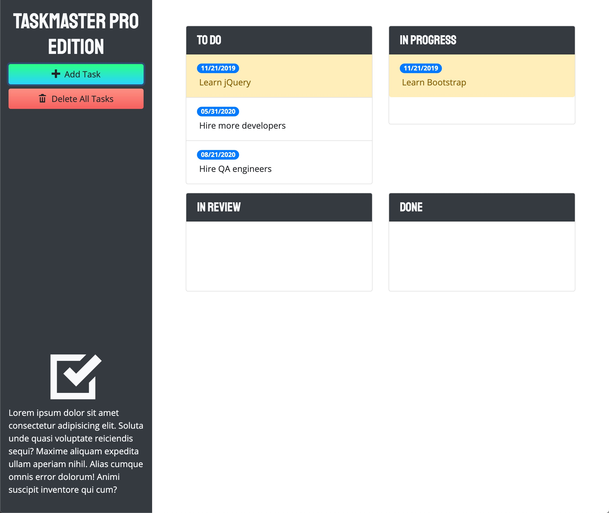

# Third-Party APIs: Taskmaster Pro

## Purpose

A task-management application called Taskmaster comes with the bellowing features:

- Create tasks with descriptions and due dates.
- Task data is persistent, thanks to localStorage.
- The Delete All button can delete tasks.

## Built With

- HTML
- JavaScript
- CSS
- jQuery
- Bootstrap
- Moment.js

## Website

Lauch at [here](https://joce1ynn.github.io/taskmaster-pro-API/)

## Contribution

Made by Wenwen Tian
